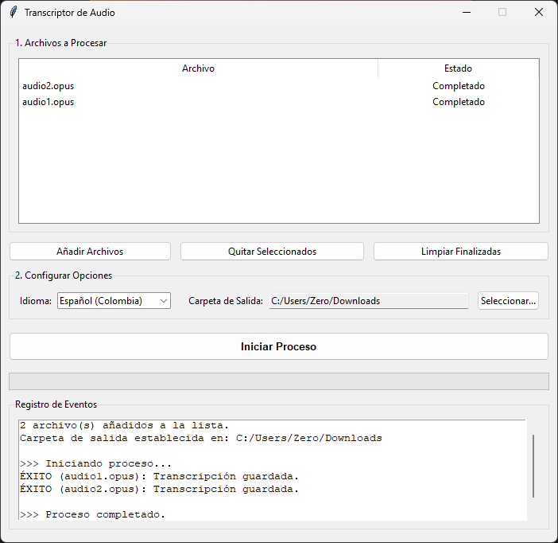

# Transcriptor de Audio v2.0

Una aplicación de escritorio para transcribir múltiples archivos de audio a texto, con procesamiento simultáneo y una interfaz gráfica de usuario moderna.



## Descripción

Esta aplicación proporciona una interfaz gráfica para seleccionar y transcribir archivos de audio de forma masiva. Utiliza la API de reconocimiento de voz de Google a través de la librería `SpeechRecognition` y `ffmpeg` para la conversión de formatos.

La herramienta ha sido diseñada para ser intuitiva y eficiente, permitiendo al usuario monitorear el progreso en tiempo real.

### Características Principales

- **Interfaz Gráfica Completa:** Maneja todo el proceso desde una ventana fácil de usar.
- **Procesamiento Concurrente:** Transcribe múltiples archivos a la vez para maximizar la velocidad.
- **Tabla de Estado en Tiempo Real:** Monitorea el estado de cada archivo individualmente (Pendiente, Convirtiendo, Transcribiendo, Completado, etc.).
- **Detección de Archivos Existentes:** Evita volver a procesar archivos que ya tienen una transcripción en la carpeta de destino.
- **Configuración Personalizable:** Permite elegir el idioma de transcripción y la carpeta de salida.
- **Guardado de Sesión:** La aplicación recuerda el último idioma y carpeta de salida utilizados.

## Requisitos

1.  **Python 3:** [https://www.python.org/downloads/](https://www.python.org/downloads/)
2.  **ffmpeg:** Herramienta esencial para la conversión de audio.
    *   **Windows:** Descargar desde [gyan.dev](https://www.gyan.dev/ffmpeg/builds/) o [BtbN](https://github.com/BtbN/FFmpeg-Builds/releases) y añadir la carpeta `bin` a la variable de entorno PATH.
    *   **macOS (usando Homebrew):** `brew install ffmpeg`
    *   **Linux (usando apt):** `sudo apt update && sudo apt install ffmpeg`

## Instalación

1.  Clona o descarga este proyecto en tu máquina local.
2.  Abre una terminal o línea de comandos y navega al directorio del proyecto.
3.  Instala las dependencias de Python ejecutando el siguiente comando:

    ```bash
    pip install -r requirements.txt
    ```

## Uso

1.  Asegúrate de tener todos los requisitos instalados.
2.  Ejecuta la aplicación desde tu terminal:

    ```bash
    python transcriptor_audio.py
    ```

3.  Se abrirá la ventana principal de la aplicación.
4.  **Añadir Archivos:** Usa el botón "Añadir Archivos" para seleccionar los audios que quieres transcribir.
5.  **Configurar Opciones:** Selecciona el idioma de la transcripción y la carpeta de salida deseada.
6.  **Iniciar Proceso:** Presiona "Iniciar Proceso". La aplicación comprobará si ya existen algunas transcripciones y luego comenzará a procesar los archivos nuevos.
7.  **Monitorear:** Observa la tabla para ver el estado de cada archivo y la barra de progreso para el avance general. El "Registro de Eventos" te dará información detallada.
8.  **Limpiar:** Una vez finalizado, puedes usar los botones "Quitar Seleccionados" o "Limpiar Finalizadas" para gestionar la lista de archivos.

Los archivos de transcripción (`transcripcion_[nombre_del_audio].txt`) se guardarán en la carpeta de salida que hayas seleccionado.